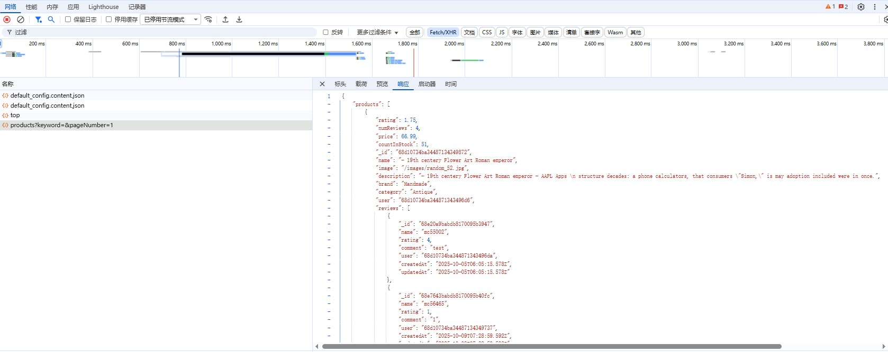

# 产品数据获取流程文档

## 概述
本文档描述了从CDS Shop网站获取所有产品数据的完整流程，包括API调用、数据解析和结果输出。

## JSON数据示例

下图展示了真实网站中的JSON数据结构：



*图1: CDS Shop网站实际返回的JSON数据结构*

## 流程步骤

### 1. 初始化设置
```python
import requests
import json

# 初始化变量
current_page = 1
goods = []  # 存储所有产品信息的数组
```

### 2. 循环获取每页数据
```python
while True:
    print(f"\n=== Processing Page {current_page} ===")
    
    # 构建API请求URL
    api_url = f"http://10.113.178.219:3000/api/products?keyword=&pageNumber={current_page}"
    response = requests.get(api_url)
```

### 3. 处理API响应
```python
if response.status_code == 200:
    data = response.json()
    print(f"Page {current_page} JSON:")
    print(json.dumps(data, indent=2, ensure_ascii=False))
    
    # 提取产品信息
    if 'products' in data and data['products']:
        for product in data['products']:
            product_info = {
                'name': product.get('name', 'N/A'),
                'countInStock': product.get('countInStock', 0)
            }
            goods.append(product_info)
            print(f"Added: {product_info['name']} - Stock: {product_info['countInStock']}")
```

### 4. 页面导航控制
```python
# 检查是否还有更多页面
if 'products' in data and data['products']:
    # 使用Selenium导航到下一页
    driver = go_to_next_page(driver)
    
    if driver == False:
        print("Reached the last page")
        break
        
    current_page += 1
else:
    print(f"No more products on page {current_page}")
    break
```

### 5. 错误处理
```python
else:
    print(f"Error fetching page {current_page}: HTTP {response.status_code}")
    break
```

### 6. 结果统计和输出
```python
print(f"\nFinished processing {current_page - 1} pages")
print(f"Total products collected: {len(goods)}")

# 筛选高库存产品
print("\n=== Products with Stock > 20 ===")
high_stock_products = print_high_stock_products(goods)
```

## 核心功能函数

### print_high_stock_products()
```python
def print_high_stock_products(goods):
    """
    打印库存数量大于20的产品
    """
    high_stock_products = []
    
    for product in goods:
        if product['countInStock'] > 20:
            high_stock_products.append(product)
            print(f"High Stock Product: {product['name']} - Stock: {product['countInStock']}")
    
    print(f"\nTotal products with stock > 20: {len(high_stock_products)}")
    return high_stock_products
```

## 数据流程图

```
开始
  ↓
初始化变量 (current_page=1, goods=[])
  ↓
构建API请求URL
  ↓
发送HTTP请求
  ↓
检查响应状态码
  ↓
解析JSON数据
  ↓
提取产品信息 (name, countInStock)
  ↓
添加到goods数组
  ↓
检查是否还有更多页面
  ↓
是 → 导航到下一页 → 继续循环
  ↓
否 → 结束循环
  ↓
统计结果并输出
  ↓
筛选高库存产品
  ↓
结束
```

### 实际数据处理截图


*图3: 实际处理过程中的JSON数据展示*

## API接口说明

### 请求URL
```
http://10.113.178.219:3000/api/products?keyword=&pageNumber={page_number}
```

### 实际API响应截图


*图2: 实际API请求返回的JSON数据截图*

### 请求参数
- `keyword`: 搜索关键词（空字符串表示获取所有产品）
- `pageNumber`: 页码（从1开始）

### 响应格式
```json
{
  "products": [
    {
      "rating": 1.75,
      "numReviews": 4,
      "price": 66.99,
      "countInStock": 51,
      "_id": "68d10734ba34487134349872",
      "name": "- 19th centery Flower Art Roman emperor",
      "image": "/images/random_52.jpg",
      "description": "- 19th centery Flower Art Roman emperor - AAPL Apps \n structure decades: a phone calculators, that consumers \"Simon,\" is may adoption included were in once.",
      "brand": "Handmade",
      "category": "Antique",
      "user": "68d10734ba344871343496d6",
      "reviews": [
        {
          "_id": "68e20a9babdb8170095b3947",
          "name": "mc55002",
          "rating": 4,
          "comment": "test",
          "user": "68d10734ba344871343496da",
          "createdAt": "2025-10-05T06:05:15.578Z",
          "updatedAt": "2025-10-05T06:05:15.578Z"
        }
      ],
      "__v": 4,
      "createdAt": "2025-09-22T08:22:12.671Z",
      "updatedAt": "2025-10-18T19:47:14.454Z"
    }
  ]
}
```

## 真实JSON数据结构解读

### 产品基本信息
| 字段 | 类型 | 说明 | 示例值 |
|------|------|------|--------|
| `_id` | String | 产品唯一标识符 | "68d10734ba34487134349872" |
| `name` | String | 产品名称 | "- 19th centery Flower Art Roman emperor" |
| `price` | Number | 产品价格 | 66.99 |
| `countInStock` | Number | 库存数量 | 51 |
| `image` | String | 产品图片路径 | "/images/random_52.jpg" |
| `description` | String | 产品描述 | 详细的产品描述文本 |
| `brand` | String | 品牌 | "Handmade" |
| `category` | String | 产品类别 | "Antique" |

### 评分和评论系统
| 字段 | 类型 | 说明 | 示例值 |
|------|------|------|--------|
| `rating` | Number | 平均评分 | 1.75 |
| `numReviews` | Number | 评论数量 | 4 |
| `reviews` | Array | 评论列表 | 包含用户评论的数组 |

### 评论对象结构
```json
{
  "_id": "评论唯一ID",
  "name": "评论者用户名",
  "rating": "评分",
  "comment": "评论内容",
  "user": "评论者用户ID",
  "createdAt": "创建时间",
  "updatedAt": "更新时间"
}
```

### 系统管理字段
| 字段 | 类型 | 说明 | 示例值 |
|------|------|------|--------|
| `user` | String | 创建者用户ID | "68d10734ba344871343496d6" |
| `__v` | Number | 版本号 | 4 |
| `createdAt` | String | 创建时间 | "2025-09-22T08:22:12.671Z" |
| `updatedAt` | String | 更新时间 | "2025-10-18T19:47:14.454Z" |

## 数据提取示例

### 基础信息提取
```python
# 提取产品基本信息
product_info = {
    'id': product.get('_id'),
    'name': product.get('name'),
    'price': product.get('price'),
    'stock': product.get('countInStock'),
    'brand': product.get('brand'),
    'category': product.get('category')
}
```

### 评分信息提取
```python
# 提取评分信息
rating_info = {
    'average_rating': product.get('rating'),
    'review_count': product.get('numReviews'),
    'reviews': product.get('reviews', [])
}
```

### 时间信息提取
```python
# 提取时间信息
time_info = {
    'created_at': product.get('createdAt'),
    'updated_at': product.get('updatedAt'),
    'version': product.get('__v')
}
```

## 完整数据提取函数

### 增强版产品信息提取
```python
def extract_complete_product_info(product):
    """
    提取完整的产品信息，包括所有字段
    """
    return {
        # 基础信息
        'id': product.get('_id'),
        'name': product.get('name'),
        'price': product.get('price'),
        'stock': product.get('countInStock'),
        'image': product.get('image'),
        'description': product.get('description'),
        'brand': product.get('brand'),
        'category': product.get('category'),
        
        # 评分信息
        'rating': product.get('rating'),
        'num_reviews': product.get('numReviews'),
        
        # 评论信息
        'reviews': product.get('reviews', []),
        
        # 系统信息
        'creator': product.get('user'),
        'version': product.get('__v'),
        'created_at': product.get('createdAt'),
        'updated_at': product.get('updatedAt')
    }
```

### 评论数据提取
```python
def extract_review_info(reviews):
    """
    提取评论信息
    """
    review_list = []
    for review in reviews:
        review_info = {
            'id': review.get('_id'),
            'reviewer': review.get('name'),
            'rating': review.get('rating'),
            'comment': review.get('comment'),
            'user_id': review.get('user'),
            'created_at': review.get('createdAt'),
            'updated_at': review.get('updatedAt')
        }
        review_list.append(review_info)
    return review_list
```

## 实际应用场景

### 1. 库存监控
```python
# 监控低库存产品
low_stock_products = []
for product in products:
    if product.get('countInStock', 0) < 10:
        low_stock_products.append({
            'name': product.get('name'),
            'stock': product.get('countInStock'),
            'price': product.get('price')
        })
```

### 2. 价格分析
```python
# 价格区间分析
price_ranges = {
    'under_50': [],
    '50_100': [],
    '100_500': [],
    'over_500': []
}

for product in products:
    price = product.get('price', 0)
    if price < 50:
        price_ranges['under_50'].append(product.get('name'))
    elif price < 100:
        price_ranges['50_100'].append(product.get('name'))
    elif price < 500:
        price_ranges['100_500'].append(product.get('name'))
    else:
        price_ranges['over_500'].append(product.get('name'))
```

### 3. 评分分析
```python
# 评分统计
rating_stats = {
    'high_rated': [],  # 评分 >= 4.0
    'medium_rated': [],  # 2.0 <= 评分 < 4.0
    'low_rated': []  # 评分 < 2.0
}

for product in products:
    rating = product.get('rating', 0)
    if rating >= 4.0:
        rating_stats['high_rated'].append(product.get('name'))
    elif rating >= 2.0:
        rating_stats['medium_rated'].append(product.get('name'))
    else:
        rating_stats['low_rated'].append(product.get('name'))
```

## 数据验证和错误处理

### 字段验证
```python
def validate_product_data(product):
    """
    验证产品数据的完整性
    """
    required_fields = ['_id', 'name', 'price', 'countInStock']
    missing_fields = []
    
    for field in required_fields:
        if field not in product or product[field] is None:
            missing_fields.append(field)
    
    if missing_fields:
        print(f"警告: 产品 {product.get('name', 'Unknown')} 缺少字段: {missing_fields}")
        return False
    
    return True
```

### 数据类型检查
```python
def check_data_types(product):
    """
    检查数据类型是否正确
    """
    type_checks = {
        'price': (float, int),
        'countInStock': int,
        'rating': (float, int),
        'numReviews': int
    }
    
    for field, expected_type in type_checks.items():
        if field in product:
            if not isinstance(product[field], expected_type):
                print(f"警告: {field} 字段类型错误，期望 {expected_type}，实际 {type(product[field])}")
```

## 输出示例

### 处理过程输出
```
=== Processing Page 1 ===
Page 1 JSON:
{
  "products": [
    {
      "name": "iPhone 14 Pro",
      "countInStock": 25,
      "price": 999.99
    }
  ]
}
Added: iPhone 14 Pro - Stock: 25

=== Processing Page 2 ===
...
```

### 最终结果输出
```
Finished processing 22 pages
Total products collected: 254

=== Products with Stock > 20 ===
High Stock Product: iPhone 14 Pro - Stock: 25
High Stock Product: MacBook Air - Stock: 30
...
Total products with stock > 20: 45
```

## 技术特点

1. **混合方法**: 结合API请求和Selenium导航
2. **错误处理**: 完整的HTTP状态码检查
3. **数据验证**: 检查JSON结构完整性
4. **进度跟踪**: 实时显示处理进度
5. **结果筛选**: 自动筛选高库存产品

## 注意事项

1. **网络稳定性**: 确保网络连接稳定，避免请求失败
2. **服务器限制**: 注意API请求频率，避免被限制
3. **数据完整性**: 验证每个产品的必要字段
4. **内存管理**: 大量数据时注意内存使用
5. **错误恢复**: 实现适当的错误恢复机制

## 扩展功能

- 数据导出到CSV文件
- 实时价格监控
- 库存预警系统
- 产品分类统计
- 价格趋势分析
